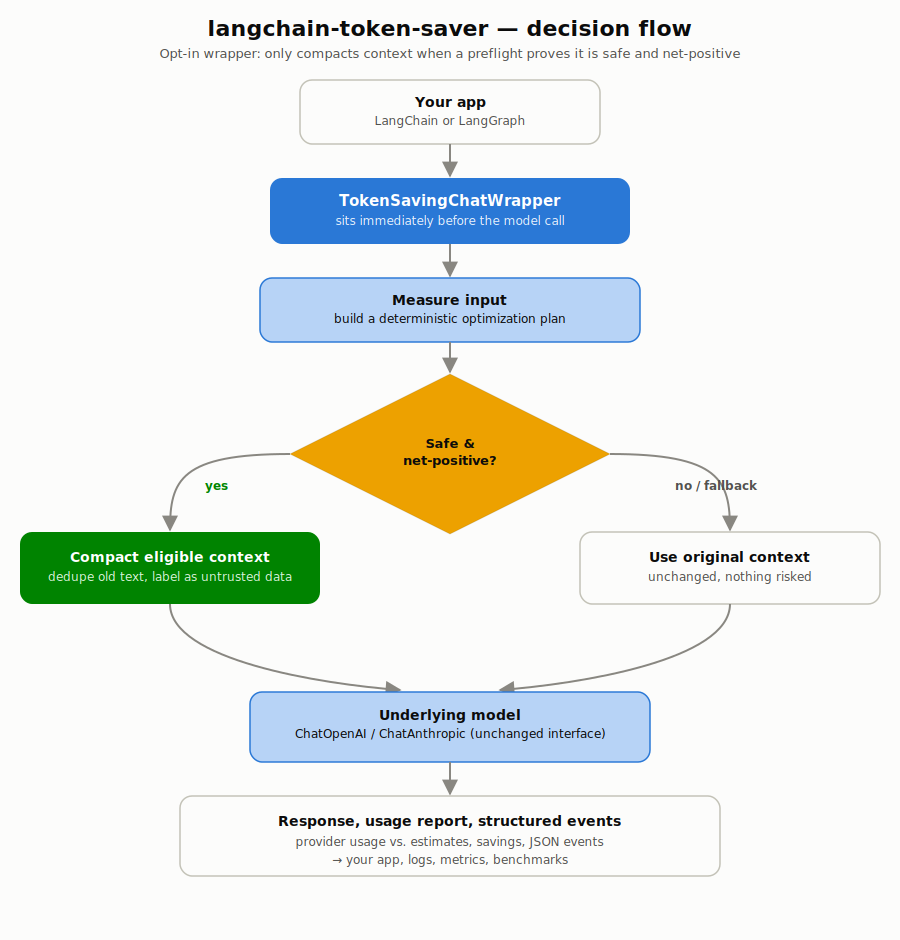
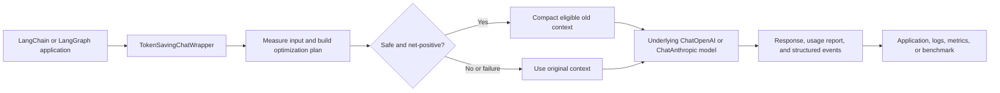

# langchain-token-saver

`langchain-token-saver` is a conservative, opt-in wrapper for LangChain chat models. It measures every decision, only applies context compaction when a deterministic preflight predicts net input-token savings, and falls back to the original input when optimization cannot be proved safe.

<p align="center">
  
</p>

## High-level flow



The wrapper sits immediately before the model call: it only changes eligible old text, preserves protocol-critical content, and makes each decision observable.

## Install

```bash
pip install langchain-token-saver[openai]
```

## Use with LangChain or LangGraph

```python
from langchain_openai import ChatOpenAI
from langchain_token_saver import CompactionConfig, OptimizationConfig, TokenSavingChatWrapper

model = TokenSavingChatWrapper(
    ChatOpenAI(model="gpt-4.1-mini"),
    config=OptimizationConfig(
        terse=True,
        compaction=CompactionConfig(threshold_tokens=3_000, preserve_recent_messages=4),
    ),
    event_handler=lambda event: logger.info("token-saver", extra=event),
)

response = model.invoke(messages)
print(model.last_report.as_dict())
```

The proxy exposes `invoke`, `ainvoke`, `stream`, `astream`, `batch`, `abatch`, `bind_tools`, and `with_structured_output`. Tool-bound and structured-output models retain context optimization but never receive a brevity instruction.

## Safety model

The default `ExtractiveCompactor` is intentionally narrow: it only deduplicates exact duplicate, older, plain-text human/AI messages. It never rewrites system instructions, tool calls/results, code fences, JSON, URLs, or identifier-looking values. It turns compacted history into clearly labelled **untrusted quoted data**, so historical prompt injection is not promoted to instruction text.

For semantic compaction, provide a `ContextCompactionStrategy` and a caller-owned `CompactionConfig(critical_fact_ledger=...)`. The strategy returns a labelled untrusted memory message and the tokens it spent; every entry from the independently supplied ledger must occur verbatim in the memory or the wrapper skips the transformation. Without a ledger, the safe default marks every unique original text as critical, making the built-in compactor lossless-by-content. The wrapper also verifies protected fragments and tool-protocol ordering.

Tool-output compaction is separately opt-in (`CompactionConfig(compact_tool_outputs=True)`) and requires the supplied strategy to implement `compact_tool_output`. The wrapper exposes only eligible plain-text result content to that strategy, requires its result to be labelled `UNTRUSTED TOOL OUTPUT`, preserves the original message type and metadata, and rejects any result that changes call/result ordering.

## Measurements and events

`TokenSavingsReport` always distinguishes provider-reported usage from local estimates. The original prompt is normally an estimate: sending a baseline call just to measure it costs tokens. Its `net_input_savings_tokens` is therefore marked `net_input_savings_source="estimated"`; a wrapper call does not claim completion or total savings without a paired baseline. `run_benchmark` produces provider-to-provider input, output, and total comparisons when both paired responses expose provider usage.

Events have stable JSON fields and version `"1"`:

- `compaction.decided`
- `compaction.dry_run_previewed`
- `compaction.fallback`
- `brevity.skipped`
- `token_savings.reported`

## CLI

Preview a decision without sending a model request:

```bash
langchain-token-saver dry-run \
  --messages-json '[{"type":"human","content":"repeat"},{"type":"human","content":"repeat"},{"type":"human","content":"latest"}]' \
  --threshold-tokens 1 --preserve-recent 1 --min-net-savings 0
```

Compare recorded measurements:

```bash
langchain-token-saver compare --baseline-json '{"total_tokens":100}' --optimized-json '{"total_tokens":70}'
```

Apply the same safe plan locally (without a model request) and print the transformed messages:

```bash
langchain-token-saver apply --messages-json '[{"type":"human","content":"..."}]' --threshold-tokens 1
```

## Benchmarks

`run_benchmark` accepts `BenchmarkTrace` items and separate baseline/optimized factories. It records per-trace usage, latency, model failures, quality-gate failures, provider-to-provider savings where comparable, and the wrapper's report. `examples/benchmark_traces.json` supplies 20 portable starting traces, including tool, structured-output, code, URL/ID, prompt-injection, and failure cases; load it with `load_benchmark_traces` and attach application-specific quality gates before running it. Use 20–50 representative traces to decide whether an optimization should ship; `summary.release_ready` remains false unless the coverage, quality gates, safety-case coverage, matching-model configuration, and exact median total-savings gates all pass.
